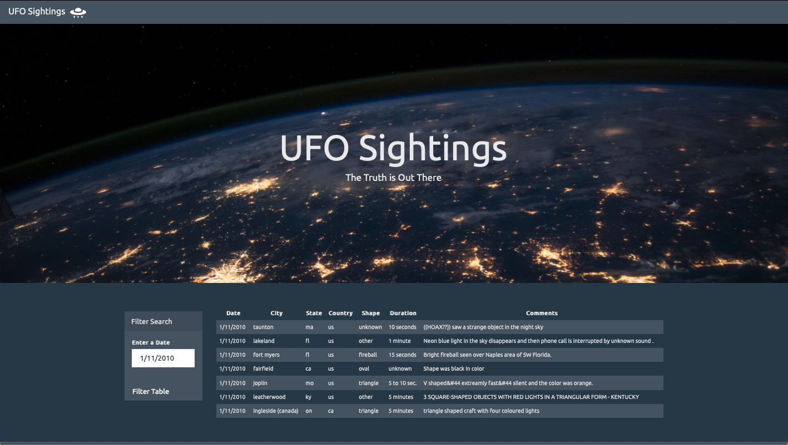
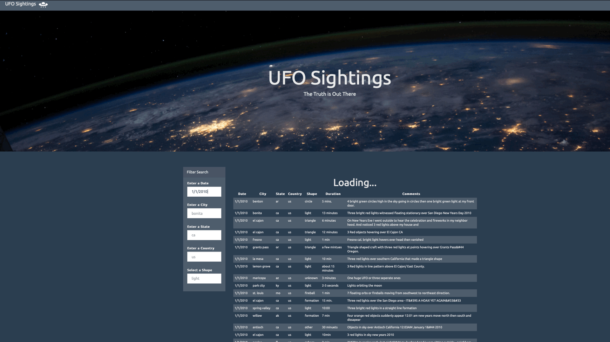

## javascript-challenge

### Level 1: Automatic Table and Date Search
* A basic provided HTML web page was used.
* The UFO dataset provided in the form of an array of JavaScript objects was used. JavaScript code was written that appends a table to the web page and then adds new rows of data for each UFO sighting.
  * Table columns: `date/time`, `city`, `state`, `country`, `shape`, and `comment`.
* A date form in the HTML document was used and JavaScript code was wriiten that listen for events and search through the `date/time` column to find rows that match user input.

### Level 2: Multiple Search Categories 
* Multiple `input` tags was used in `index.html`, so the user can to set multiple filters and search for UFO sightings using the following criteria based on the table columns:
  1. `date/time`
  2. `city`
  3. `state`
  4. `country`
  5. `shape`
  

## Disclaimer
The resources of this master branch are only for educational purposes. All reserved rights belong to UCSD Data Science and Visualization Boot Camp.
